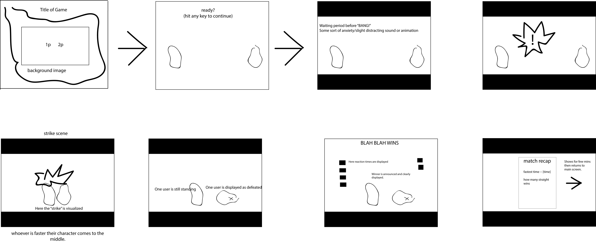

# Samurai-Slash

# [Link to my Trello] (https://trello.com/b/rAcxfX7i/project-one)

 

3/28:  Basic layout of game today. Got the background image to sit still and cover the entire page - a success. Also began testing with basic shape elements. Started devising random timing mechanism in beginning and setting down a basic expected timeline for the game's progress

3/29: Much more difficult today. Hard refinement of game timeline - which functions fire when. Major difficulty with the False start firing. Had to separate click event listeners out from the functions that I wanted to occur from them. So many things were happening simultaneously...not good. Finally revamped this at end of day and was able to resume working on the scoring mechanism.

3/30: Worked on animating the game this morning as well as mapping the specific keyboard codes to the players - moving away from using clicking as a test mechanism. Extracted images from previously made sprite sheets online then made my own sprite sheets which I was able to then map out and use to make simple animations. Flipped the same character and was able to mirror the motions. Then worked on scoring. Was able to have fastest times determined and then also came up with the false start function. Figured out how to toggle classes on button press. Seperated what the buttons would do when fired at certain times, this was especially difficult and required making global variables seperated from their more local counterparts. End of day was spent styling and then bug testing which turned into another ordeal involving my reset function. False start function became a real pain because it was the exception to the rest of the game. Had to refactor my larger reset function to account for this. However, now I am so so pleased with how the players return to their respective spaces after a successfull bout.

3/31: added music to homepage and little bit of styling. Then lots and lots of github Pages issues, which eventually worked out. Needed to not be putting underscores in my filepaths.

